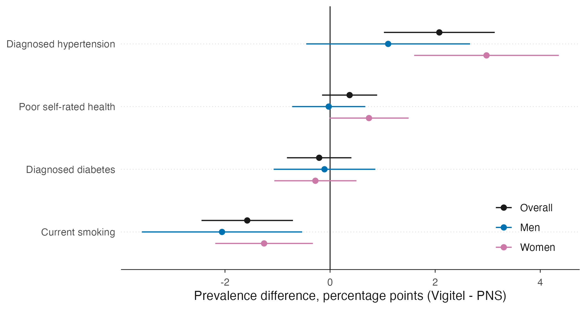
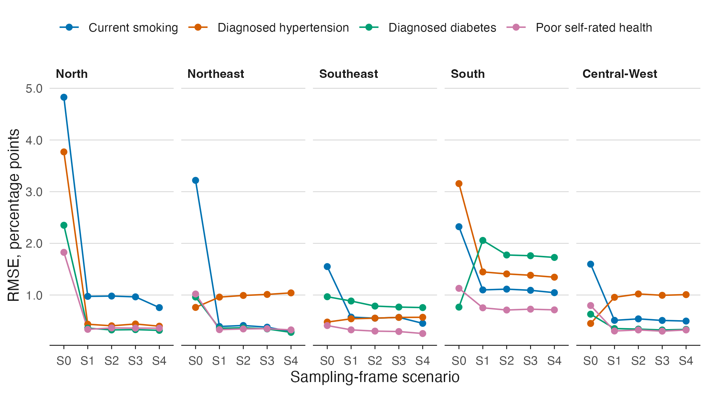
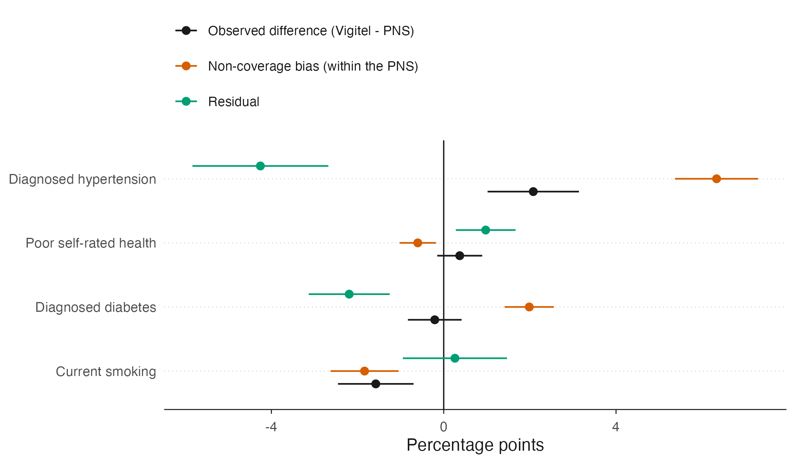

# Landline non-coverage bias in Vigitel estimates

Quantifies the non-coverage bias of **Vigitel** — Brazil's landline-telephone
surveillance survey — using the **PNS 2019** as a probabilistic reference,
partitions the prevalence gap into a non-coverage component and a residual, and
simulates five sampling-frame scenarios under the ADEMP framework.

Every number in this repository comes from code that ran over the downloaded
microdata. Nothing is quoted from the literature or from memory.

> **Status:** manuscript in preparation · Vigitel 2019 × PNS 2019 · 26 state
> capitals + Federal District · adults aged 18 years or over

---

## Key findings

**In 2019, 60.3% of adults in the 27 capitals had no landline** — the share of the
population that Vigitel's sampling frame could not reach at all.

**The observed differences are small.** Vigitel minus PNS, in percentage points
(Table 2):

| Indicator | Vigitel | PNS | Δ (95% CI) | p (Holm) |
|---|---|---|---|---|
| Current smoking | 9.84 | 11.42 | −1.58 (−2.45, −0.71) | 0.001 |
| Diagnosed hypertension | 24.52 | 22.44 | +2.08 (1.02, 3.13) | <0.001 |
| Diagnosed diabetes | 7.45 | 7.65 | −0.21 (−0.82, 0.41) | 0.51 |
| Poor self-rated health | 4.82 | 4.45 | +0.37 (−0.15, 0.90) | 0.33 |

**The non-coverage bias is not small — and that is the point.** Estimated entirely
*within* the PNS, it exceeds the observed gap or runs against it (Table 4):

| Indicator | Total gap | Non-coverage component (95% CI) | Residual (95% CI) |
|---|---|---|---|
| Current smoking | −1.58 | −1.84 (−2.63, −1.05) | +0.26 (−0.95, 1.47) |
| Diagnosed hypertension | +2.08 | **+6.33 (5.37, 7.30)** | −4.25 (−5.83, −2.68) |
| Diagnosed diabetes | −0.21 | **+1.99 (1.42, 2.56)** | −2.19 (−3.13, −1.25) |
| Poor self-rated health | +0.37 | −0.60 (−1.03, −0.18) | +0.97 (0.28, 1.67) |

A small published gap is therefore **not** evidence of a small coverage problem:
for hypertension a +6.33 pp coverage bias is offset by a −4.25 pp residual. The two
parts nearly cancel, and the survey looks accurate for the wrong reason.

**Cochran's relative bias exceeds the 0.40 threshold in all 24 indicator × domain
cells** (Table 3): the nominal 95% coverage of the intervals degrades everywhere,
not only in the regions with the sparsest landline coverage.

**Post-stratification helps unevenly** — it removes 14% of the coverage bias for
smoking and 90% for diabetes (Table 4). Calibration on age, education and sex
cannot fix what it does not measure.

**A dual frame captures almost the whole available gain** (Table 5, Figure 2). Mean
RMSE across regions and indicators, by scenario:

| S0 landline only | S1 mobile only | S2 dual frame | S3 triple frame | S4 full multimodal |
|---|---|---|---|---|
| 1.65 pp | 0.70 pp | 0.68 pp | 0.67 pp | 0.64 pp |

The worst single cell falls from 4.83 pp (smoking, North, landline only) to 1.77 pp
under a dual frame. Everything beyond the dual frame buys hundredths of a point.

**The prediction survives contact with the real transition.** When Vigitel adopted
a dual frame in 2023, the direction of change agreed with the 2019 prediction for
three of the four indicators (Pearson r = 0.93 over four points — descriptive, not
a test; Table 6).

---

## Figures

**Figure 1** — Prevalence difference between Vigitel 2019 and PNS 2019, overall and
by sex (`figure1_sex`).



**Figure 2** — RMSE by sampling-frame scenario and macro-region. The whole gain is
between S0 and S1/S2.



**Gap partition** — the observed difference next to its two parts. The
non-coverage component is not a fraction of the gap. Produced by the pipeline as
`figure1`; not in the current manuscript draft.



---

## Outputs

| Where | What |
|---|---|
| `output/tables_en/` | Tables 1–6 and S1–S7 in English — `.docx` and `.html`, plus the underlying data in `*_dados.rds` |
| `output/tables/` | The same tables in Portuguese |
| `output/figures_en/` | Figures 1–3 and S1–S3 in English — `.pdf` (vector) and `.png` (300 dpi, 180 mm) |
| `output/figures/` | The same figures in Portuguese |
| `output/supplement/` | Assembled supplementary material, `supplementary_material_en.docx` and `material_suplementar.docx` |
| `output/logs/` | Provenance: external-validation checks, full simulation grid, session info, package versions |
| `manuscript/` | Current draft, with tables and figures already in English |

---

## Reproducing

Every script starts with `source(here::here("R", "00_setup.R"))`. Run in order, or
`Rscript run_all.R`.

| # | Script | Produces |
|---|---|---|
| 00 | `R/00_setup.R` | Packages, seed (20260803), study parameters, palette, `output/logs/sessioninfo.txt` |
| 01 | `R/01_download.R` | Microdata into `data-raw/` (PNS, PNAD-C ICT, Census via SIDRA); checks that the Vigitel files are present |
| 02 | `R/02_harmoniza.R` | Harmonised `data/derivado/*.rds` and the item-equivalence dictionary (→ Table S1) |
| 03 | `R/03_desenho.R` | `srvyr` design objects, validated against the published official prevalences |
| 04 | `R/04_descritivas.R` | Sample characteristics with standardised differences (→ Table 1) |
| 05 | `R/05_prevalencias.R` | Prevalences, Δ, prevalence ratios, sex × survey interaction, Holm correction, age standardisation (→ Table 2) |
| 06 | `R/06_particao.R` | Non-coverage bias and the gap partition (→ Tables 3 and 4) |
| 07 | `R/07_bootstrap.R` | Rao-Wu bootstrap over the design, 1,000 replicates |
| 08 | `R/08_simulacao.R` | ADEMP simulation, 5 scenarios × region × indicator, 1,000 replicates per cell |
| 09 | `R/09_validacao_2023.R` | Confronts the prediction with the real 2023 dual-frame transition (→ Table 6) |
| 10–12 | `R/10_tabelas.R`, `R/11_figuras.R`, `R/12_suplemento.R` | Tables, figures and supplement (Portuguese) |
| 13 | `R/13_manuscrito.R` | Narrated results, every number interpolated from the saved objects |

### English outputs

The three scripts below read the same objects from `data/derivado/` and **recompute
nothing** — they translate labels, notes and numeric formatting. They require the
main pipeline to have run.

```sh
Rscript run_en.R     # R/10_tabelas_en.R → R/11_figuras_en.R → R/12_suplemento_en.R
```

`R/labels_en.R` holds the PT→EN dictionaries and the English number formatters.

### Manuscript translation

`tools/traduz_docx.py` translates the tables and the table/figure captions inside a
`.docx`, preserving structure, styles, numbering and footnote markers. Numbers are
never retyped — only the notation changes (decimal comma → point, thousands
separator → comma, `" a "` → `" to "`). It aborts without writing if any text
segment is missing from `tools/traducoes_tabelas.py`.

```sh
python3 tools/traduz_docx.py "<file>.docx" --dry-run
python3 tools/traduz_docx.py "<file>.docx"
```

---

## Data sources

| Source | Year | How it is obtained |
|---|---|---|
| PNS | 2019 | `PNSIBGE::get_pns()` — the only edition with a telephone-ownership module |
| Vigitel | 2019, 2023 | **manual** — no API; see `R/01_download.R` for the expected files in `data-raw/vigitel/` |
| PNAD Contínua ICT | 2019 | `PNADcIBGE::get_pnadc()` — telephone-ownership parameters for the simulation |
| Census | 2022 | `sidrar::get_sidra()` — adult population by sex, age group and capital, used only as the standard population for direct age standardisation |

`data-raw/` and `data/` are git-ignored (9.4 GB). The original microdata are never
edited: all transformation happens in `R/02_harmoniza.R`.

---

## Conventions

- **Sign:** Δ = Vigitel − PNS, in every table and figure, without exception.
- **Residual:** what remains of the gap after non-coverage is called "residual",
  never "mode effect" — mode is a hypothesis discussed in the text, not a column
  label. It jointly absorbs mode of collection, self-report, instrument
  differences, non-response and weight calibration; this design cannot separate
  them.
- Code comments in Portuguese; object and function names in English.
- Every path through `here::here()`; never `setwd()`.
- Fixed seed (20260803) everywhere randomness enters.

---

## Layout

```
R/              pipeline scripts (00–13) + the *_en.R English variants
R/_arquivo_v1/  earlier draft of these scripts, kept for provenance
tools/          docx translation script and its PT→EN dictionary
output/         tables, figures, supplement and logs (committed)
manuscript/     manuscript drafts and the companion presentation
archive_v1/     the three-component 2006–2023 design published here until May 2026
data/           harmonised objects (git-ignored)
data-raw/       original microdata (git-ignored)
```

## Licence and citation

Code and outputs released under the [MIT licence](LICENSE). Citation metadata in
[`CITATION.cff`](CITATION.cff) and [`codemeta.json`](codemeta.json).

The Portuguese version of this README is in [README.pt-BR.md](README.pt-BR.md).
The design published here until May 2026 — three components, 2006–2023 — is kept
in [`archive_v1/`](archive_v1/).
