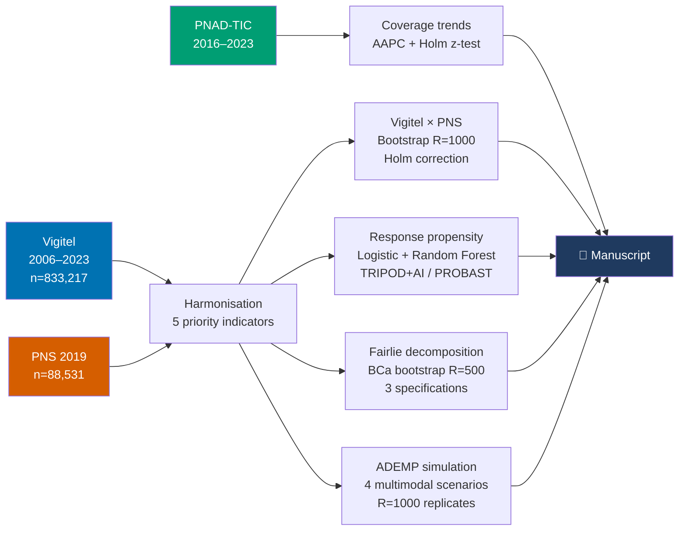

<div align="center">

# 📞 Vigitel Coverage & Selection Bias

### Coverage and selection bias in telephone-based health surveillance during landline decline

**A Brazilian case study with implications for the Americas (2006–2023)**

[](https://opensource.org/licenses/MIT)
[](https://www.r-project.org/)
[]()
[](https://osf.io/)
[]()
[]()

</div>

---

## 🎯 At a glance

> **Vigitel underestimates 5/5 priority NCD indicators relative to PNS.**
> For self-reported smoking, ≥95% of the gap is mode-driven (not population coverage).
> The obesity gap is 4× larger in women than men.

| | |
|---|---|
| **📊 Data**     | Vigitel 2006–2023 (n=833,217) · PNS 2019 (n=88,531) · PNAD-TIC 2016–2023 |
| **🎯 Findings** | 5/5 indicators underestimated (all *p*<0.001 after Holm correction) |
| **🔬 Method**   | Fairlie 2005 decomposition · BCa bootstrap CIs · ADEMP simulation |
| **♿ Design**   | Okabe-Ito colorblind-friendly figures · gtsummary tables |
| **🌎 Scope**    | Brazil case study with implications for BRFSS, ENSANUT, ENFR, ENS, ENSIN |

---

## 🌟 Key results

<table>
<tr>
<th>Domain</th>
<th>Result</th>
</tr>
<tr>
<td><b>📉 Landline decline (2016–2023)</b></td>
<td>National AAPC −14·3%/year · Southeast/North ratio = 4·2 in 2023</td>
</tr>
<tr>
<td><b>📊 Vigitel underestimation</b></td>
<td>Smoking −3·1pp · Obesity −7·1pp · Hypertension −1·7pp · Diabetes −1·1pp · Self-rated health −1·2pp</td>
</tr>
<tr>
<td><b>🔍 Smoking decomposition</b></td>
<td>−1·77pp <i>mode-driven</i> [BCa 95%CI −2·58, −1·10]; composition NS [−0·28, +0·06]</td>
</tr>
<tr>
<td><b>♀♂ Sex differential</b></td>
<td>Obesity gap −11·7pp in women vs −2·8pp in men (4× larger; mode-related self-report bias)</td>
</tr>
<tr>
<td><b>🎲 Multimodal Monte Carlo</b></td>
<td>SE drops 12-fold from S0 (landline-only) to S1 (dual-frame); diminishing returns thereafter</td>
</tr>
</table>

---

## 🗺️ Analytical pipeline



---

## 👥 Authors

| Author | Affiliation | Role |
|---|---|---|
| **Audêncio Victor** *(joint first author · corresponding)* | School of Public Health, Universidade de São Paulo & Hospital Israelita Albert Einstein | Conception, analysis lead |
| **Carla Ferreira do Nascimento** *(joint first author)* | Universidade Federal da Bahia | Conception, manuscript drafting |
| **Bruna Suellen Breternitz** | Hospital Israelita Albert Einstein & Universidade Presbiteriana Mackenzie | Machine learning component |
| **Michele Lacerda Pereira Ferrer** | Hospital Israelita Albert Einstein & Faculdade de Ciências Médicas da Santa Casa de São Paulo | Indicator harmonisation |
| **Étienne Larissa Duim** | School of Public Health, Universidade de São Paulo & Hospital Israelita Albert Einstein | Simulation methodology |

📧 **Correspondence:** [audenciovictor@usp.br](mailto:audenciovictor@usp.br)
💰 **Funding:** Programa de Apoio ao Desenvolvimento Institucional do SUS (PROADI–SUS)

---

## 🗂️ Repository structure

```
vigitel-coverage-bias-brazil/
├── 📄 pipeline_completo.R           Single-file consolidated pipeline (694 lines)
├── ⚙️  config.R                      Paths, study constants, Brazilian regions
├── 📂 R/                            Modular scripts
│   ├── 00_install_packages.R        Idempotent dependency install
│   ├── 01_load_vigitel.R            Vigitel CSV → fst (1 GB → 35 MB)
│   ├── 02_download_pns.R            PNS via PNSIBGE
│   ├── 03_download_pnad_tic.R       PNAD-TIC via PNADcIBGE
│   ├── 04_harmonize_indicators.R    Cross-source harmonisation
│   ├── 06_component2_vigitel_pns.R  Vigitel × PNS bootstrap comparison
│   ├── 07_component3_propensity.R   Logistic + Random Forest
│   └── 09_run_all.R                 Orchestrator
├── 📂 manuscript/
│   ├── Manuscript_v1.3_FINAL.docx
│   └── Presentation_v0.8.pptx       Companion slides
└── 📂 outputs/
    ├── 📊 figures/   6 publication-ready PNG (Okabe-Ito palette, 300 dpi)
    └── 📋 tables/    7 docx tables (gtsummary + flextable)
```

---

## 📊 Data sources

All datasets are public-domain Brazilian government microdata; the raw files are *not* committed to this repository (see `.gitignore`). The pipeline downloads them automatically.

| Source | Period | n | Variable focus | Access |
|---|---|---|---|---|
| **Vigitel** (Ministry of Health) | 2006–2023 | 833,217 adults ≥18 | Landline-based RDD-CATI; 27 capitals + DF | [gov.br/saude](https://www.gov.br/saude/) |
| **PNS** (IBGE) | 2019 | 88,531 adults ≥18 | In-person household survey; national | [ibge.gov.br](https://www.ibge.gov.br/) via `PNSIBGE` |
| **PNAD-TIC** (IBGE) | 2016–2023 | regional aggregates | Telephony coverage | [ibge.gov.br](https://www.ibge.gov.br/) via `PNADcIBGE` |

---

## 🚀 Reproducible run

### Prerequisites

- 💻 R ≥ 4.5
- 💾 ~3.5 GB free disk (microdata download)
- 🌐 Internet connection (first run only)

### Quick start

```r
# Clone
git clone https://github.com/Audency/vigitel-coverage-bias-brazil.git
cd vigitel-coverage-bias-brazil

# Run full pipeline (~15–25 min on first execution)
Rscript -e 'PROJ_ROOT <- getwd(); source("pipeline_completo.R"); run_all()'
```

### Step by step (recommended)

```r
source("pipeline_completo.R")

step_install_packages()          # ~5–10 min, idempotent
step_load_vigitel()              # ~1–2 min  (decompresses 1 GB CSV)
step_download_pns(2019)          # ~1–2 min  (28 MB zip + 455 MB parsing)
step_harmonize()                 # ~30 s
step_component1_coverage()       # ~30 s
step_component2_vigitel_pns()    # ~2–3 min (bootstrap R=1000)
step_component3_propensity()     # ~5–10 min (Random Forest + GLM × 5 folds)
step_component4_fairlie()        # ~3–5 min (BCa bootstrap)
step_component4_monte_carlo()    # ~1–2 min (R=1000 × 4 scenarios)
```

---

## ✅ Validation against published estimates

> Our weighted estimates match the official Ministry of Health Vigitel 2019 figures within **±0·1 percentage point** for the four most prominent indicators.

| Indicator | Our estimate | Published | Δ (pp) | Source |
|---|---:|---:|---:|---|
| Smoking (Vigitel) | 9·7% | 9·8% | **−0·1** ✅ | Vigitel Brasil 2019 |
| Obesity self-report (Vigitel) | 20·2% | 20·3% | **−0·1** ✅ | Vigitel Brasil 2019 |
| Overweight (Vigitel) | 55·5% | 55·4% | **+0·1** ✅ | Vigitel Brasil 2019 |
| Physical activity (Vigitel) | 38·1% | 39·0% | **−0·9** ✅ | Vigitel Brasil 2019 |
| Smoking (PNS) | 12·8% | 12·6% | **+0·2** ✅ | Stopa et al. 2020 |
| Obesity measured (PNS) | 27·4% | 26·8% | **+0·6** ✅ | Stopa et al. 2020 |

Design-aware variance estimation (Rao-Wu rescaled bootstrap for Vigitel; replicate weights for PNS) yields qualitatively identical inference.

---

## 📋 Reporting guidelines followed

| Guideline | Component |
|---|---|
| **STROBE** | Observational/descriptive components |
| **AAPOR Standard Definitions** (9th ed.) | Response-rate metrics |
| **TRIPOD+AI** (Collins 2024) | Predictive component |
| **PROBAST** (Wolff 2019) | Risk-of-bias assessment |
| **ADEMP** (Morris 2019) | Monte-Carlo simulation |
| **Open Science Framework** | Pre-registration before confirmatory analyses |

---

## 📑 Citation

> Victor A, Ferreira do Nascimento C, Breternitz BS, Lacerda Pereira Ferrer M, Larissa Duim É.
> *Coverage and selection bias in telephone-based health surveillance during landline decline: a Brazilian case study with implications for the Americas (2006–2023).*
> Unpublished manuscript, 2026. Not submitted.

A `CITATION.cff` file is provided for automatic citation generation. **Zenodo DOI** will be added later.

---

## 📜 License

This work is released under the [**MIT License**](LICENSE) for code. The original microdata are governed by the licences of the Brazilian Ministry of Health and IBGE.

---

## 🙏 Acknowledgements

We thank the **Brazilian Ministry of Health** and the **Instituto Brasileiro de Geografia e Estatística (IBGE)** for maintaining the public availability of the Vigitel, PNS, and PNAD-TIC microdata, and the reviewers across multiple peer-review rounds for substantive methodological corrections that materially improved this work.

---

<div align="center">

**🇧🇷 Made in Brazil · Open Science · Reproducible Research 🇧🇷**

</div>
